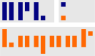
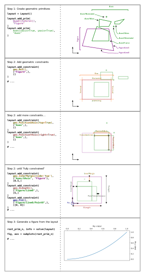

# MPLLayout



## Summary

MPLLayout is a package to create precise figure layouts in [matplotlib](https://matplotlib.org/).
It works by modelling figure elements using geometric primitives (for example, text anchors are points, the figure is a quadrilateral, etc.), then constraining the sizes and positions of these elements using geometric constraints (for example, fixing the width of a figure, constraining axes sides to be collinear, constraining axes to lie on a grid, etc.).

Using this approach, MPLLayout can:

* align figure elements (axes, text label location, x and y axis, etc.),
* specify margins around axes,
* create templates for figures across different mediums (posters, manuscripts, slides, etc.),
* and more!

## Basic usage

The tutorial notebook in `examples/tutorial.ipynb` demonstrates the basic usage of the package and explains some of the commonly used geometric constraints.
Other examples are also given in the `examples` folder.
The notebook at `examples/ten_simple_rules_demo.ipynb` contains an interactive demo to recreate a figure from ["Ten Simple Rules For Better Figures"](https://journals.plos.org/ploscompbiol/article?id=10.1371/journal.pcbi.1003833) (Rougier, Droettboom and Bourne 2014).

A summary of how to use the package is shown in the figure below.
The process resembles creating and constraining geometry in computer-aided design programs like AutoCAD, SolidWorks, etc.


## Motivation

Matplotlib contains several strategies for creating figure layouts (for example, `GridSpec` and `subplots` for grid-based layouts).
While these approaches work well, greater control over figure element positions is sometimes desirable;
for example, when preparing figures for published documents, research papers, or slides.

## Installation

You can install the package from PyPI using

```bash
pip install matplotlib-layout
```

Alternateively, clone the repository into a local drive.
Navigate to the project directory and run

```bash
pip install .
```

The package requires `numpy`, `matplotlib`, and `jax`.

## Contributing

This project is a work in progress so there are likely bugs and missing features.
If you would like to contribute a bug fix, a feature, refactor etc. thank you!
All contributions are welcome.

## Motivation and Similar Projects

A similar project with a geometric constraint solver is [`pygeosolve`](https://github.com/SeanDS/pygeosolve).
There is also another project prototype for a constraint-based layout engine for `matplotlib` [`MplLayouter`](https://github.com/Tillsten/MplLayouter), although it doesn't seem active as of 2023.
