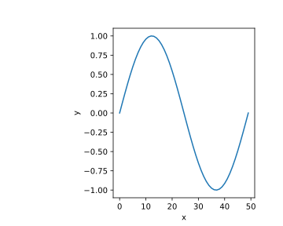

# MPLLayout


## Summary

MPLLayout is a package to create precise figure layouts in [matplotlib](https://matplotlib.org/).
It works by modelling figure elements using geometric primitives (for example, text anchors are points, the figure is a quadrilateral, etc.), then constraining the sizes and positions of these elements using geometric constraints (for example, fixing the width of a figure, constraining axes sides to be collinear, constraining axes to lie on a grid, etc.).

Using this approach, MPLLayout can:

* align figure elements (axes, text label location, x and y axis, etc.),
* specify margins around axes,
* create templates for figures across different mediums (posters, manuscripts, slides, etc.),
* and more!

## Basic usage

The basic workflow to create a constrained layout is demonstrated through this example with a single axes figure.
To create a figure 5 in wide and 4 in tall use the code:

```python
import numpy as np
from matplotlib import pyplot as plt

from mpllayout import layout as ly
from mpllayout import primitives as pr
from mpllayout import constraints as cr
from mpllayout import matplotlibutils as mputils
from mpllayout import solver

# The layout object stores the geometry and constraints defining the layout
layout = ly.Layout()

# To add geometry, pass the: geometry primitive and a string key.
# Naming the `Quadrilateral`, "Figure" will cause mpllayout to identify it as a figure
layout.add_prim(pr.Quadrilateral(), "Figure")

# To create a constraint, pass the: constraint, geometry to constrain, and
# constraint arguments.
# Constraint documentation describes what kind of geometry can be constrained and
# any constraint arguments.
layout.add_constraint(cr.Box(), ("Figure",), ())
layout.add_constraint(cr.Width(), ("Figure",), (5.0,))
layout.add_constraint(cr.Height(), ("Figure",), (4.0,))
```

To create an axes inside the figure with desired margins around the edges, use the code:

```python
# To add an axes, pass the `Axes` primitive
# The `Axes` is container of Quadrilaterals representing the drawing area (frame),
# as well as, optionally, the x-axis and y-axis
layout.add_prim(pr.Axes(), "MyAxes")

# Constrain the axes drawing area to a box
layout.add_constraint(cr.Box(), ("MyAxes/Frame",), ())
# Set "inner" margins around the outside of the axes frame to the figure
# The inner margin is the distance from a `Quadrilateral` inside another
# `Quadrilateral`
layout.add_constraint(cr.InnerMargin(side="bottom"), ("MyAxes/Frame", "Figure"), (.5,))
layout.add_constraint(cr.InnerMargin(side="top"), ("MyAxes/Frame", "Figure"), (.5,))
layout.add_constraint(cr.InnerMargin(side="left"), ("MyAxes/Frame", "Figure"), (2.0,))
layout.add_constraint(cr.InnerMargin(side="right"), ("MyAxes/Frame", "Figure"), (0.5,))
```

The desired layout can then be solved and used to create a plot.

```python
# Create the figure and any axes from the solved geometry
fig, axs = mputils.subplots(solved_prims)

x = np.linspace(0, 2*np.pi)
axs["MyAxes"].plot(np.sin(x))
```

The code above results in the figure:


While this approach requires more code to specify the layout of figure elements, it allows precise specification of the layout.
This can be useful, for example, in publication documents where precise figure, axes, and font sizes are desired.
In addition, layouts can be adjusted (for example, by adjusting margin arguments) and serve as a template to generate multiple figures.

More examples can be found in the `examples` folder which demonstrate other constraints and geometric primitives used to achieve more complicated layouts.
The example given above can be found at `examples/README_example.ipynb`.
The tutorial notebook in `examples/tutorial.ipynb` demonstrates the basic usage of the package and explains some of the commonly used geometric constraints.
Other examples are also given in the `examples` folder.
The notebook at `examples/ten_simple_rules_demo.ipynb` contains an interactive demo to recreate a figure from ["Ten Simple Rules For Better Figures"](https://journals.plos.org/ploscompbiol/article?id=10.1371/journal.pcbi.1003833) (Rougier, Droettboom and Bourne 2014).

## Motivation

Matplotlib contains several strategies for creating figure layouts (for example, `GridSpec` and `subplots` for grid-based layouts).
While these approaches work well, greater control over figure element positions is sometimes desirable;
for example, when preparing figures for published documents, research papers, or slides.

## Installation

You can install the package from PyPI using

```bash
pip install matplotlib-layout
```

Alternateively, clone the repository into a local drive.
Navigate to the project directory and run

```bash
pip install .
```

The package requires `numpy`, `matplotlib`, and `jax`.

## Contributing

This project is a work in progress so there are likely bugs and missing features.
If you would like to contribute a bug fix, a feature, refactor etc. thank you!
All contributions are welcome.

## Motivation and Similar Projects

A similar project with a geometric constraint solver is [`pygeosolve`](https://github.com/SeanDS/pygeosolve).
There is also another project prototype for a constraint-based layout engine for `matplotlib` [`MplLayouter`](https://github.com/Tillsten/MplLayouter), although it doesn't seem active as of 2023.
